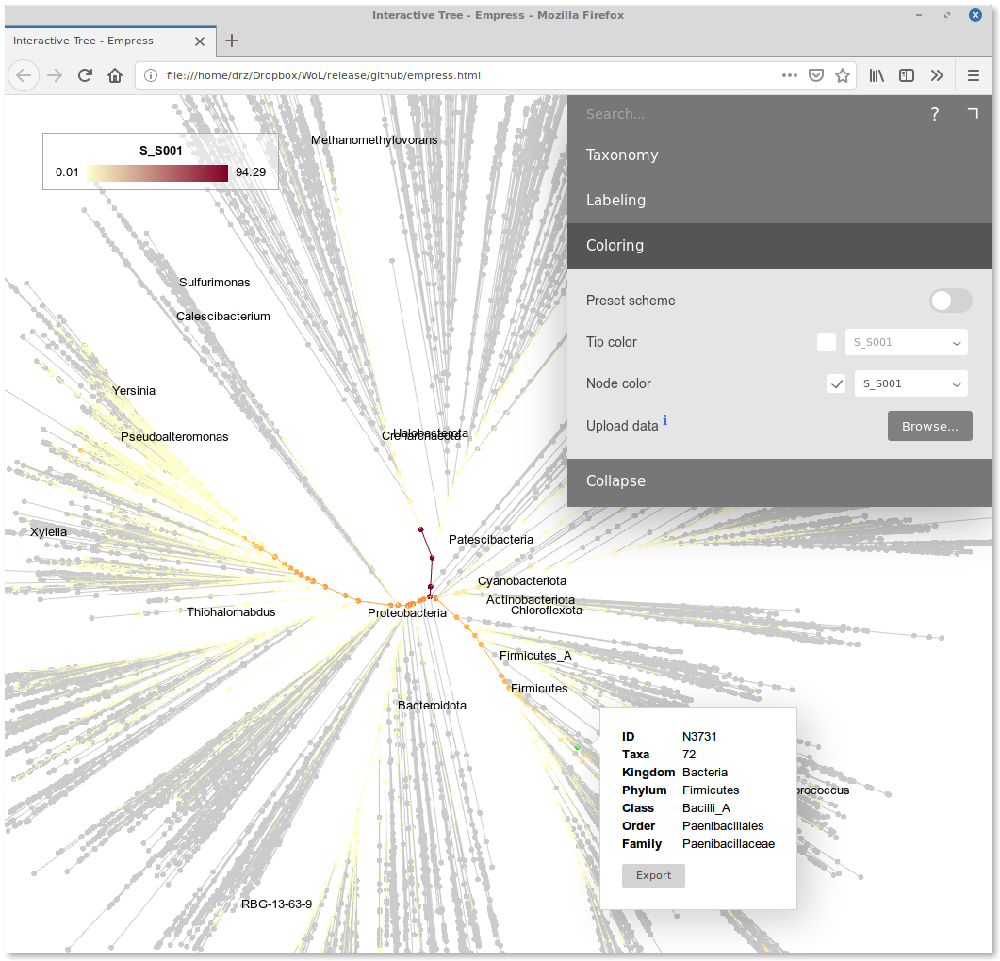
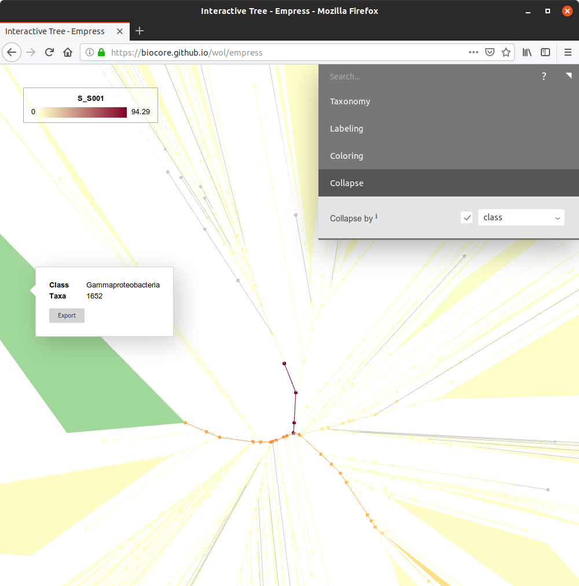

## Phylogeny-based profiling

- [Overview](#Overview)
- [Phylogenetic hierarchy](#Phylogenetic-hierarchy)
- [Fake taxonomy from tree](#Fake-taxonomy-from-tree)
- Examples:
  - [Kraken](#Kraken)
  - [Centrifuge](#Centrifuge)
  - [SHOGUN](#SHOGUN---UTree)
- [Visualization](#Visualization)

### Overview

This protocol introduces how to perform metagenomic profiling using existing tools (e.g., Kraken, Centrifuge, SHOGUN), but instead of classifying sequences by taxonomy, it directly assigns sequences to **tips or internal nodes** of the reference phylogeny. This delivers higher resolution, more accurate assignment, and enables better intepretation of data in light of evolution.


### Phylogenetic hierarchy

The practice of "metagenomic profiling", or "classification" typically relies on the taxonomic hierarchy (i.e., phylum - class - order ... species). It is overly simple in terms of describing the relationships among organisms, comparing with a phylogenetic tree, especially when the number of reference genomes is large.

Let us take genome [G000008865](https://www.ncbi.nlm.nih.gov/assembly/GCF_000008865.1/) (_Escherichia coli_ O157:H7 str. Sakai) for example. Its taxonomic lineage is:

    k__Bacteria; p__Proteobacteria; c__Gammaproteobacteria; o__Enterobacterales; f__Enterobacteriaceae; g__Escherichia; s__Escherichia coli

Whereas its "**phylogenetic lineage**" according to our [reference tree](../data/trees/astral/branch_length/cons/collapsed/astral.cons.nid.e5p50.nwk) is:

    N3;N7;N14;N41;N66;N101;N154;N234;N332;N452;N782;N971;N1163;N1390;N1641;N1913;N2521;N2839;N3180;N3530;N3891;N4259;N5003;N5851;N6294;N6723;N7150;N7546;N7949;N8335;N8680;N8963;N9223;N9443;N9629;N9782;N9907;N10016;N10109;N10189;N10254;N10316;N10378;N10427;N10459;N10486;N10507;N10528;N10546;G000008865

Many more levels, isn't it?

Profiling with a phylogenetic tree will deliver much finer resolution than with the taxonomic hierarchy. Depending on one's research scope, this could deliver new insights into the data.

Plus, taxonomy is known to be inaccurate and changeable (think of the example of _Escherichia_ vs. _Shigella_, and that of _Clostridium_), whereas phylogeny is more accurate and better mathematically defined.


### Fake taxonomy from tree

Most modern profilers use the taxonomic hierarchy to guide classification. Actually, for multiple programs, this "hierarchy" is flexible, and one can replace it with the phylogenetic lineages shown above so that the program will think "phylogenetically".

We provide [**tree_to_taxonomy.py**](../code/scripts/tree_to_taxonomy.py), which converts a phylogenetic tree into "fake taxonomy" files:

```bash
tree_to_taxonomy.py tree.nwk
```

- Optionally, this script allows the user to specify branch support and branch length cutoffs. Please see its command line inteface.

This script generates fake taxdump files (`names.dmp` and `nodes.dmp`), a genome ID to fake TaxID map (`g2tid.txt`), and a fake lineage map (`g2lineage.txt`).

One may also want to generate a nucleotide accession to fake TaxID map. This can be done using a Bash command:

```bash
join -12 -21 nucl2g.txt g2tid.txt -o1.1,2.2 -t$'\t' > nucl2tid.txt
```

- The file [nucl2g.txt](../data/genomes/nucl2g.txt.bz2) is provided in this repository.

Now let us see some example usages.


### Kraken

[**Kraken**](https://ccb.jhu.edu/software/kraken/) ([Wood and Salzberg, 2014](https://genomebiology.biomedcentral.com/articles/10.1186/gb-2014-15-3-r46)) is a widely used taxonomic profiler for WGS data. It relies on the taxonomic hierarchy to determine the lowest common ancestor (LCA) of reference genomes where (_k_-mers of) the query sequence is mapped to.

Here we show how to replace the default taxonomic hierarchy (the NCBI taxdump) with our reference phylogeny. We will use Kraken 1.0 for example.

#### Database building

1. Specify a directory to host the Kraken database, say, `dbdir`.

2. Create subdirectory `taxonomy`. Place the fake taxdump files (`names.dmp` and `nodes.dmp`) we generated above into it.

3. Create subdirectory `library/added/`. Place the uncompressed genome sequences (e.g., `G000123456.fna`) into this directory.

4. In `library/added/`, create a file `prelim_map.txt`. Its content is like:

```
TAXID <tab> NC_000001.1 <tab> 12345
TAXID <tab> NC_000002.1 <tab> 6789
...
```

This can be done using a simple Bash command, from the file `nucl2tid.txt` we already generated above:

```bash
sed -e 's/^/TAXID\t/' nucl2tid.txt > library/added/prelim_map.txt
```

5. Now build the Kraken database:

```bash
kraken-build --build --db dbdir --threads 32
```

- Here `32` is the number of CPUs equipped in your system. Please customize.

6. Finally, clean up the database directory. 

```bash
kraken-build --clean
```

#### Profiling

The commands are exactly the same as one does with a regular (original) Kraken database:

```bash
kraken --db dbdir --threads 32 --paired R1.fq.gz R2.fq.gz --output output.tsv 2> log.txt
kraken-report --db dbdir output.tsv > output.report
```

Now take a look at `output.report`. You will see a list of number of sequences and relative abundances of tip (starting with `G`) and internal nodes (starting with `N`).

Here is a real example. We took the low-complexity toy dataset (`S_S001`) from the [1st CAMI challenge](https://data.cami-challenge.org/) ([Sczyrba et al., 2017](https://www.nature.com/articles/nmeth.4458)). If one profiles it with the original NCBI taxonomy, the report file looks like:

```
  0.00  0       0       U       0       unclassified
100.00  40334552        0       -       1       root
100.00  40334552        40829   -       131567    cellular organisms
 94.29  38031114        131753  D       2           Bacteria
 48.16  19423204        7711    -       1783272       Terrabacteria group
 34.64  13973035        2274120 P       1239            Firmicutes
 18.88  7616977 3106    C       91061             Bacilli
 18.71  7547478 5791    O       1385                Bacillales
 18.20  7340520 1046    F       186822                Paenibacillaceae
 18.19  7335590 1066307 G       44249                   Paenibacillus
 ...
```

With the phylogenetic hierarchy, it is like:

```
  0.00  0       0       U       0       unclassified
100.00  40334552        40830   -       1       N1
 94.29  38031111        4043    -       3         N3
 94.25  38016970        808     -       7           N7
 94.25  38016043        89756   -       14            N14
 48.16  19423150        7382    -       39              N39
 34.64  13972410        32      -       226               N226
 34.64  13971873        875     -       321                 N321
 34.58  13949620        138821  -       587                   N587
 32.83  13241176        0       -       754                     N754
...
```

One can convert this file into a plain node ID to relative abundance map:

```bash
cat S_S001.report | grep -v $'unclassified$' | awk -v OFS='\t' '{print $NF, $1}' > S_S001.txt
```


### Centrifuge

[**Centrifuge**](https://ccb.jhu.edu/software/centrifuge/) ([Kim et al., 2016](https://genome.cshlp.org/content/26/12/1721.long)) is a metagenomic classifier which features the compression of closely related reference genomes. The classification step is also guided by the taxonomic hierarchy. Similarily, we can replace the taxonomy with phylogeny.

Build database:

```bash
centrifuge_build --seed 42 --threads 32 --conversion-table nucl2tid.txt --taxonomy-tree nodes.dmp --name-table names.dmp nucl.fna dbname
```

Run search:

```bash
centrifuge --seed 42 -p 32 -1 R1.fq.gz -2 R2.fq.gz -x dbname -S output.map --report-file output.report
```

Generate a Kraken-style report we explained above:

```bash
centrifuge-kreport -x dbname output.tsv > output.kreport
```


### SHOGUN - UTree

[**SHOGUN**](https://github.com/knights-lab/SHOGUN) ([Hillmann et al., 2018](https://msystems.asm.org/content/3/6/e00069-18)) is a novel metagenomics pipeline developed by our team. It features the accurate handling of **shallow** shotgun sequencing data. With as few as 0.5 million sequences per sample (thus cost is very low as comparable to 16S rRNA sequencing), one can obtain decent classification and diversity analysis results that are comparable to the outcome of deep sequencing.

SHOGUN provides three classification tools for user choice: Bowtie2, UTree and BURST. Bowtie2 and BURST are pure sequence aligners, and taxonomic classification step is performed after the map is obtained. Therefore they can take advantage of the curated taxonomy (see [genome database](genome_database) for how) but not the phylogenetic tree itself.

[**UTree**](https://github.com/knights-lab/UTree) is a _k_-mer profile & taxonomic hierarechy-guided classifier. In this sense it is similar to Kraken, but it is significantly faster and consumes significantly less computational resource (especially memory).

The support for phylogeny instead of taxonomy is built-in in UTree.

Build database:

```bash
utree-build_gg reference.fna nucl2tid.txt temp.ubt 0 2
utree-compress temp.ubt dbname.ctr
rm temp.ubt temp.ubt.gg.log
```

Run search by directly calling UTree:

```bash
utree-search_gg dbname.ctr input.fa output.txt 32 RC
```

Or via the SHOGUN interface:

```bash
shogun align -t 32 -d dbdir -a utree -i input.fa -o .
```

UTree generates a mapping file, in which each query sequence is directly assigned to a taxonomic lineage (here phylogenetic clade). It is like (S_S001):


### Visualization

We developed [Empress](https://github.com/biocore/empress/), an interactive tree viewer that renders trees with 1M+ tips on the fly. Here is a [**live version**](../empress) showing the current reference phylogeny. It allows one to upload and visualize the profiling result as color gradient on the tree.

In the "Colors" tab of the interface, upload the node ID-to-abundance file we discussed above (`S_S001.txt`). In the tip/node color dropdown, there will be an extra option "S_S001". Select it.

Here is a tree-shaped heatmap of your microbiota:



The root of the tree has the deepest color, indicating that at this level, the relative abundance is close to 100%. Starting from the root, the color depth decreases and diversifies. Some lineages are darker than the background. They are what the microbial community is composed of.

One can move the mouse cursor over those dark nodes to see their IDs and taxonomic annotations (using either NCBI or GTDB). One can collapse the tree at certain taxonomic rank in the "Collapse" tab to get a cleaner view.


